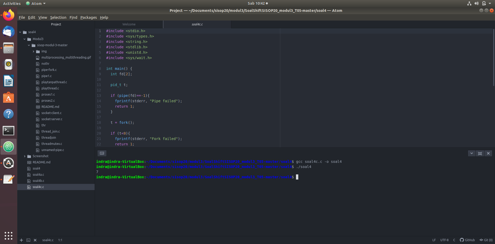

# SoalShiftSISOP20_modul3_T05
#### Anggota Kelompok:
1. I Gede Pradhana Indra Widnyana (05311840000031)
2. Agung Mulyono (05311840000035)


### [Link Soal Shift](https://github.com/agung56/SoalShiftSISOP20_modul3_T05/blob/master/SoalShiftModul3.pdf)

## Soal 1
Kode Program: [soal1.c](https://github.com/agung56/SoalShiftSISOP20_modul3_T05/tree/master/soal1)

## Soal 2
Kode Program: [soal2.c](https://github.com/agung56/SoalShiftSISOP20_modul3_T05/tree/master/soal2)

## Soal 3
Kode Program: [soal3.c](https://github.com/agung56/SoalShiftSISOP20_modul3_T05/blob/master/soal3/soal3.c)

## Soal 4
Kode Program: [soal4a.c](https://github.com/agung56/SoalShiftSISOP20_modul3_T05/blob/master/soal4/soal4a.c)
              [soal4b.c](https://github.com/agung56/SoalShiftSISOP20_modul3_T05/blob/master/soal4/soal4b.c)
              [soal4c.c](https://github.com/agung56/SoalShiftSISOP20_modul3_T05/blob/master/soal4/soal4c.c)
#### Penjelasan Script 4 A
```c
#include<stdio.h>
#include<sys/shm.h>
#include<sys/ipc.h>
#include<sys/wait.h>
#include<sys/types.h>
#include<unistd.h>
#include<stdlib.h>
#include<pthread.h>
#include<string.h>
```

Script diatas merupakan semua library standar dalam bahasa pemrograman C yang digunakan dalam proses ini.

```c
int row=0;
int I[4][2] = {{2, 5},
               {3, 1},
               {4, 5},
               {2, 1},};
int J[2][5] = {{2, 3, 4, 5, 1},
               {4, 5, 1, 2, 3}};
int K[4][5];

```

Script diatas adalah matriks yang nantinya akan dikalikan satu sama lain dan nantinya hasil dari perkalian matriks I dan matriks J disimpan dalam matriks K
```c
void* perkalianmatrix(void* arg){
  int x=row++;

  for(int y=0; y<5; y++){
    for(int z=0; z<2; z++){
      K[x][y] = K[x][y] + I[x][z] * J[z][y];
    }
  }
 ```
 Selanjutnya script diatas adalah proses dari perkalian antara matriks I dengan matriks J, dimana **row** digunakan untuk mengidentifikasi baris ke- dan selanjutnya proses perkalian dilakukan tiap kolom antara kolom matriks I dengan kolom matriks J setelah itu dijumlah dan hasilnya dimasukkan dalam matriks K.
```c
int main(){
  int *matriks;
  int i=4,j=5;

  pthread_t tid[4];
  for(int a=0; a<4; a++){
    pthread_create(&tid[a], NULL, &perkalianmatrix, NULL);
  }
  for (int a=0; a<4; a++){
    pthread_join(tid[a], NULL);
  }

key_t key = 1234;
int shmid = shmget(key, sizeof(int)*i*j, IPC_CREAT | 0666);
matriks = (int *)shmat(shmid, NULL, 0);

printf("Hasil Perkalian Matrix: \n");
for(int b=0; b<i; b++){
  for(int c=0; c<j ; c++){
    printf("%2d\t", K[b][c]);
  }
  printf("\n");
}
sleep(10);

shmdt(matriks);
shmctl(shmid, IPC_RMID, NULL);
}
```
Selanjutnya membuat thread sesuai baris yang ada pada matriks K dan join antara thread satu dengan thread yang lain, kemudian membuat **shmid** yang digunakan sebagai id matriks K agar dapat dilihat pada program lain. Dan yang terakhir adalah menampilkan hasil dari perkalian dua matriks tadi.

### Output


#### Penjelasan Script 4 B
```c
#include<stdio.h>
#include<sys/shm.h>
#include<sys/ipc.h>
#include<sys/wait.h>
#include<sys/types.h>
#include<unistd.h>
#include<stdlib.h>
#include<pthread.h>
#include<string.h>
```
Script diatas merupakan semua library standar dalam bahasa pemrograman C yang digunakan dalam proses ini.
```c
int row=0;
int K[4][5];
void* factorialgantitambah(void* arg){
  int i= *((int*)arg);
  free(arg);

  int total=0;
  for(int a=i; a>0; a--){
    total=total+j;
  }

  if(row > 4){
    printf("\n");
    row=0;
  }
  printf("%4d", total);
  row++;

}
```
Script diatas merupakan proses penjumlahan yang dilakukan tiap nilai yang ada pada matriks tersebut (contoh: 5+4+...+1) dan menyimpannya kedalam variabel **total**. Setelah penjumlahan selesai, dilakukan pengecekan pada jumlah baris, jika jumlah baris yang ada pada matriks tersebut lebih dari 4 (karena total baris pada matriks harusnya 4) maka baris tersebut merupakan spasi dan langsung ditampilkan pada terminal dan selanjutnya menampilkan nilai dari **total** tadi.

```c
int main(){
  key_t key = 1234;
  int shmid = shmget(key, sizeof(int)*i*j, IPC_CREAT | 0666);
  matriks = (int *)shmat(shmid, NULL, 0);

  printf("Hasil Perkalian Matrix: \n");
  for(int b=0; b<i; b++){
    for(int c=0; c<j ; c++){
      printf("%2d\t", K[b][c]);
    }
    printf("\n");
  }

  printf("hasil setelah ditambah: \n");
  pthread_t tid[20];


  sleep(10);

  shmdt(matriks);
  shmctl(shmid, IPC_RMID, NULL);


```
Script diatas tidak jauh beda dengan script 4 A tadi karena proses yang digunakan sama yaitu menggunakan shared memory. Namun kelompok kami tidak dapat menyelesaikan soal tersebut dikarenakan kami mengalami kebingungan untuk menampilkan matriks yang ada pada 4 A dan menampilkan matriks yang baru, karena setelah kami mencobanya berulang-ulang tetap saja nilainya tidak muncul.


#### Penjelasan Script 4 C
```c
#include <stdio.h>
#include <sys/types.h>
#include <string.h>
#include <stdlib.h>
#include <unistd.h>
#include <sys/wait.h>
```

Script diatas merupakan semua library standar dalam bahasa pemrograman C yang digunakan dalam proses ini.
```c
int main() {
  int fd[2];

  pid_t t;

  if (pipe(fd)==-1){
    fprintf(stderr, "Pipe failed");
    return 1;
  }

  t = fork();

  if (t<0){
    fprintf(stderr, "Fork failed");
    return 1;
  }
```

selanjutnya untuk script diatas merupakan script dasar untuk membuat IPC pipes yaitu dengan pipe dan fork (seperti yang ada di dalam modul 3) yaitu dengan membuat 2 array dengan istilah sebagai 2 lubang pada pipa. dimana selanjutnya akan ada 2 tipe command yaitu 0 untuk read dan 1 untuk write
```c
  if (t==0){
    dup2(fd[1],1);
    close(fd[0]);
    close(fd[1]);

    char *jalan[]={"ls", NULL};
    execv("/bin/ls", jalan);
  }
```

selanjutnya adalah menggunakan pipe dan fork sebelumnya dengan menjalankan perintah **if dan else** untuk if yang pertama yaitu menjalankan perintah pertama yaitu perintah **Listing** atau **ls**. untuk terlebih dahulu melist semua jenis folder maupun file yang ada di dalam direktori tersebut.
```c
else{
    dup2(fd[0],0);
    close(fd[0]);
    close(fd[1]);
    char *jalan[] = {"wc", "-l", NULL};
    execv("/usr/bin/wc", jalan);
  }

  return 0;
}
```

Langkah terakhir dalam proses ini adalah dengan mengghitung jumlah hasil listing tersebut dengan command **wc -l** command tersebut merupakan command untuk menghitung satu persatu file ataupun folder yang sudah ada di dalam suatu **line** hasil dari proses listing sebelumnya, sehingga akan didapat jumlah dari file ataupun folder yang ada dalam direktori tersebut.

### Output

